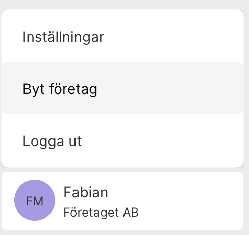

# Improve PLEO

[Pleo]() is a really nice service. It's a pre-paid mastercard, that does two things that I love:

1. Scans your email for receipts, and automatically attaches them to the expense.
2. Let's you import all the transactions to your accountnig software ([FortNox](https://www.fortnox.se/))

# This should

I have seen two things that needs fixing. The *fetch function*, that I think is the main reason to use Pleo, and the ability to use the app when you have two companies.
## Fetch

Pleo has a smart little function they call [Fetch](https://pleo.io/se/fetch), it can conenct to your email account, scan for receipts and automatically match it with expenses.

### Allow me to use more than one email account

Right now I can only connect one email account. For most people, this might be okay. But I do run multiple separate businesses in my company, they all have their own email setup, and work as independent teams.

Your service only allows me to connect to ONE email account. The API you are using allows you to connect with multiple accounts.

<kbd>

</kbd>

### Allow me to moderate the queue

Sometimes you get it wrong. I had a charge of **SEK 6** made by **Google**, and you connected it with a **SEK 3 654** invoice from **Amazon Web Services**.

**I would like to:**
- Disconnect that document
- Click a button to fetch other possible matches.
- If you get multiple options, let me see and choose.

## Multiple accounts

Not only does some of my companies have multiple mailboxes. I also have multiple companies. I'm sure I'm not the only client of yours that have more than one company.

<kbd>

</kbd>

Today, whenever I do a purchase using my Pleo Card, I need to do the following:

1. Enter my card details on the website
2. Submit the form, which kicks in 3D Secure, it asks me to verify the purchase in the app.
3. Start the PLEO app on my phone
4. Enter my passcode, or use FaceID to unlock the app.
5. Click the user icon in the bottom right.
6. Scroll down to the "LOGOUT" link.
7. Click "LOGOUT and get taken to the login screen.
8. Click "CONTINUE"
9. Enter my email
10. Click "CONTINUE"
11. Enter my passcode, that triggers an sms being sent to me.
12. Enter the code from my SMS.
13. NOW i can approve the purchase.

The whole idea with Pleo is to **make thing simple**. Pleo already has support for multiple users, so I know that the company and the user are two separate things in their system.

Currenlty a commpany can be associated with multiple users, but please, let us associate users with multiple copanies, and make it easy to switch.

**What I think should happen** when I need to do a 3d secure verification is:

1. Enter my card details on the website
2. Submit the form, which kicks in 3D Secure, it asks me to verify the purchase in the app.
3. Start the PLEO app on my phone
4. Enter my passcode, or use FaceID to unlock the app.
5. Approve the purcahse. The dialog should say something like this:

<kbd align="center">
&nbsp;

**Glesys&nbsp;AB** 

wants to charge

**SEK&nbsp;199**

from

&nbsp;&nbsp;&nbsp;&nbsp;&nbsp;**Fabian&nbsp;Mosserg&nbsp;AB**&nbsp;&nbsp;&nbsp;&nbsp;&nbsp;

<kbd align="center">Accept</kbd> <kbd align="center">Reject</kbd> 

</kbd>

---

### Changelog

- [2021-06-14] - First version of my suggestions.
