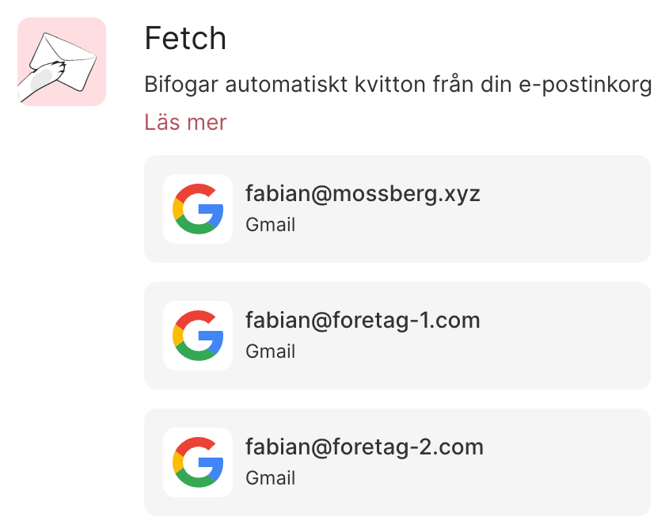

# Improve PLEO

[Pleo]() is a really nice service. It's a pre-paid mastercard, that does two things that I love:

1. Scans your email for receipts, and automatically attaches them to the expense.
2. Let's you import all the transactions to your accountnig software ([FortNox](https://www.fortnox.se/))

# This needds to be fixed

## Fetch

Pleo has a smart little function they call [Fetch](https://pleo.io/se/fetch), it can conenct to your email account, scan for receipts and automatically match it with expenses.

### #1 Allow me to use more than one emaila account.

Right now I can only connect one email account. For most people, this might be okay. But I do run multiple separate businesses in my company, they all have their own email setup, and work as independent teams.

Your service only allows me to connect to ONE email account. The API you are using allows you to connect with multiple accounts.

### #2 Allow me to switch between companies.

Not only does some of my companies have multiple mailboxes. I also have multiple companies. I'm sure I'm not the only client of yours that have more than one company.

---

### Changelog

- [2021-06-14] - First versino of my suggestions.
